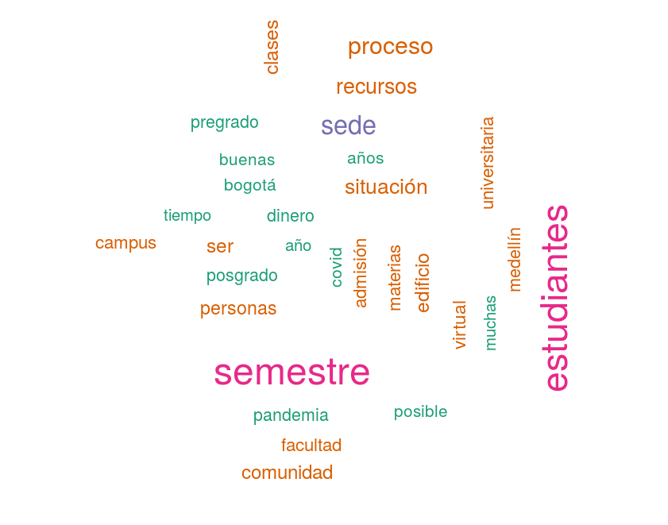
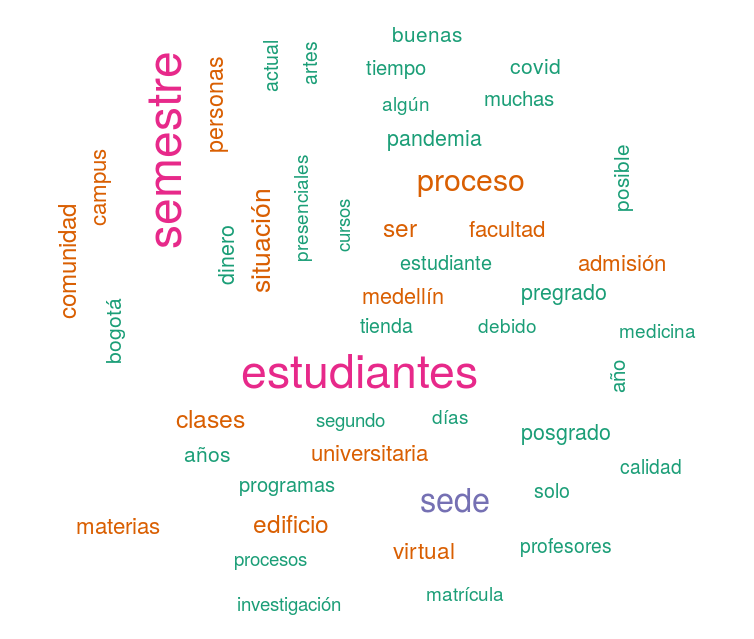
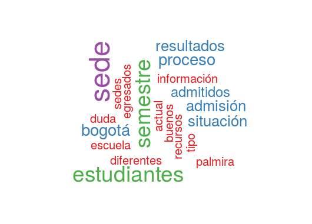

```{js logo-js, echo=FALSE}
$(document).ready(function() {
  $('#header').parent().prepend('<div id=\"logo\"><a href="http://estadisticas.unal.edu.co/home/" target="_blank"></div>');
  $('#header').css('margin-right', '60px')
});
```


<br>
<h4><DIV ALIGN="right"><a href="https://github.com/estadisticaun/Rcuentas/raw/master/RC_PDF.pdf">Descargar documento en PDF</a></DIV></h4>
<br>


```{r setup, include=FALSE}
knitr::opts_chunk$set(echo = FALSE, warning = FALSE, fig.cap ='<br> Fuente: Dirección Nacional de Planeación y Estadística', fig.show='hold')
```


## Introducción

Este documento presenta el análisis de texto a partir de las preguntas recibidas en el proceso permanente de [Rendición de Cuentas](http://launalcuenta.unal.edu.co/) de la [Universidad Nacional de Colombia](https://unal.edu.co) para la vigencia 2019. El contenido de las preguntas aquí analizadas se recibió antes, durante y después de la audiencia de rendición de cuentas institucional la cual se llevo a cabo el jueves 11 de junio del año en curso. Las preguntas se recibieron a través de cuatro medios de comunicación institucional: Página web de [Rendición de Cuentas](http://launalcuenta.unal.edu.co/), [Facebook Live](https://www.facebook.com/UNALOficial/), [Twitter](https://twitter.com/unaloficial?lang=es) y [YouTube](https://www.youtube.com/channel/UC1wJbI-Z0U24G-H_64SSNPg).


## Consideraciones metodológicas

El análisis que se presenta a continuación se realizó a través de los softwares estadísticos [R](https://www.r-project.org/) y la IDE [Rstudio](https://rstudio.com/). Los procesos de importación, transformación de datos y depuración del contenido de las preguntas con el fin de eliminar artículos, preposiciones, verbos, números, signos de puntuación y caractéres especiales propios del español, se llevó a cabo a través del uso de las librerías *tidytext*, *NLP*, *tm*, *tidyverse*, *readr* y *knitr*. Las visualizaciones y la publicación web de los resultados se realizó con el apoyo de los paquetes *RColorBrewer*, *Rmarkdown*, *ggplot2*, *wordcloud* y de GitHub Pages. Finalmente, en el repositorio [Rcuentas](https://github.com/estadisticaun/Rcuentas) del espacio web en [GitHub](https://github.com/estadisticaun) de la [Oficina Nacional de Estadística](http://estadisticas.unal.edu.co/home/), se encuentran disponibles los scripts empleados en este análisis. 


## Análisis 

A continuación se presenta un breve análisis sobre la cantidad y el contenido que hace parte de las preguntas recibidas. Este análisis se divide en dos partes: análisis descriptivo y análisis de texto.

### Análisis descriptivo

Durante el proceso de Rendición de Cuentas del año 2019 se recibió un total de 704 preguntas. De estas, como se presenta en la Figura \@ref(fig:F1Medio), la página web de [Rendición de Cuentas](http://launalcuenta.unal.edu.co/), con un 89% (624 preguntas), fue el medio a través del cual se recibió la mayor cantidad de preguntass.


```{r}
Fuentes <- read.delim("Data/Preguntas.txt", header = TRUE)

Fuentes$Medio <- as.character(Fuentes$Medio)
Fuentes$Pregunta <- as.character(Fuentes$Pregunta)
```


```{r F1Medio}

library(ggplot2)
ggplot(data=Fuentes, aes(Fuentes$Medio)) +
  geom_bar(fill = "#a6bddb")+
  geom_text(stat='count', aes(label=..count..), vjust=-1, size = 5)+
  ggtitle("Cantidad de preguntas recibidas según medio de recepción", 
          subtitle = "Proceso de Rendición de Cuentas - 2019 \n") +
  xlab("\n Medio de recepción de preguntas") + ylab("Total de preguntas \n") +
  ylim(0,700)+
  theme(
    axis.title.x = element_text(size=14, face="bold"),
    axis.title.y = element_text(size=14, face="bold"),
    axis.text.x =  element_text(size = 12, color = "red"),
    axis.text.y =  element_text(size = 12),
    legend.position="top")

```

### Análisis Texto  

A continuación, en las figuras \@ref(fig:F2Nube1) y \@ref(fig:F3Nube2) se presentan las nubes con las 30 y 50 palabras más empleadas en las 704 preguntas recibidas en el contexto del proceso de Rendición de Cuentas 2019. Así mismo, la Figura \@ref(fig:F4Nube3), presenta la nube de palabras con las 20 palabras más empleadas en las preguntas recibidas a través de las redes sociales (80 preguntas) durante la audiciencia realizada el día 11 de junio del año 2020.

<br>

#### Descripción resultados 30 palabrás más frecuentes

<br> 

* **Breve Análisis**: como se observa en la Figura \@ref(fig:F2Nube1), las palabras **semestre** y **estudiantes** fueron las que con más frecuencia se presentarón en el contenido de las preguntas. Preguntas asociadas a situaciones puntuales en las sedes de la Universidad así como inquietudes relacionadas con procesos, facultades, recursos, edificios, asignaturas y situaciones en los campus, se presentaron con importante frecuencia en las preguntas realizadas. Inquietudes sobre la virtualidad así como sobre el Covid - 19, dada la contingencia de salud pública actual, puntuaron de manera importante.

```{r F2Nube1, out.width='80%'}

```

<br>

#### Descripción resultados 50 palabrás más frecuentes

<br> 

* **Breve Análisis**: Además de lo analizado a partir del comportamiento observado en la Figura \@ref(fig:F2Nube1), la Figura \@ref(fig:F3Nube2) nos muestra las 50 palabrás más empleadas en las preguntas recibidas. Pandemia, tienda universitaria, inquietudes sobre clases presenciales, situaciones del postgrado, dinero, aspectos relacionados con profesores y temas de investigación, entre otros, amplian el espectro de inquietudes observado en la Figura \@ref(fig:F2Nube1) cuando se explora la nube de preguntas con los 50 términos más empleados.   


```{r F3Nube2, out.width='80%'}

```

<br>

#### Preguntas en redes sociales (Facebook, Twitter y YouTube)

<br> 

* **Breve Análisis**: La Figura \@ref(fig:F4Nube3) presenta la nube de palabras con los 20 términos más empleados en las 80 preguntas hechas a través de las redes sociales institucionales las cuales, en su mayoría, se presentaron durante la audiencia de este proceso. Como se puede observar en esta figura, situaciones relacionadas con los estudiantes y lo que pasa o pasará en los semestres, segudio de temas relacionados con la Sede Bogotá puntuaron de manera importante a través de las inquietudes expresadas en redes sociales. No menos importante fue el número de inquietudes recibidas a través de estos medios en lo relacionado con el proceso actual de admisión a la Universidad y sus resultados en el marco de la pandemia.   

```{r F4Nube3, out.width='80%'}

```
