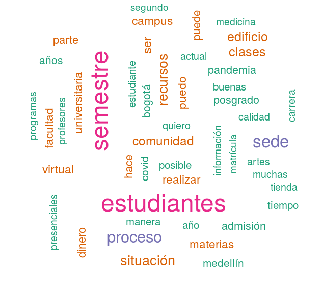

```{r setup, include=FALSE}
knitr::opts_chunk$set(echo = TRUE)
```

## Presentación

This is an R Markdown document. Markdown is a simple formatting syntax for authoring HTML, PDF, and MS Word documents. For more details on using R Markdown see <http://rmarkdown.rstudio.com>.

When you click the **Knit** button a document will be generated that includes both content as well as the output of any embedded R code chunks within the document. You can embed an R code chunk like this:

## Nubes de Palabras

### Cincuenta


 


